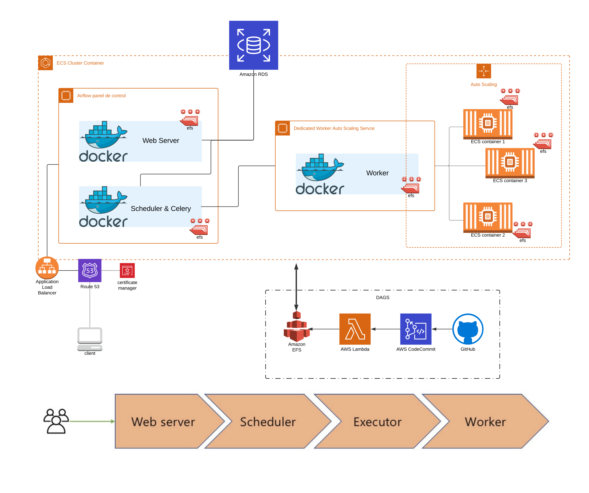

# Data Airflow

[TUTORIALS](https://github.com/mikeroyal/Apache-Airflow-Guide)

### External projects that would be awesome to implement

1. [Flower UI](https://appliku.com/post/celery-flower)
2. [Whirl](https://github.com/godatadriven/whirl)
3. [Elyra ! (data science)](https://github.com/elyra-ai/elyra)
4. [ZenML ! (data science)](https://github.com/zenml-io/zenml)
5. [Medium - Custom ui for airflow](https://medium.com/@caxefaizan/creating-custom-ui-for-airflow-7021c851631c)
6. [TAC - help to boilerplate](https://github.com/vipul-tm/TAC-Airflow-Plugin)
7. [X-tended api](https://github.com/anr007/airflow-xtended-api#create_dag)
8. [Logs to Cloudwatch](https://airflow.apache.org/docs/apache-airflow-providers-amazon/3.1.1/logging/cloud-watch-task-handlers.html)

### Data lineage that would be awesome to implement

1. [Datahub.io](https://datahubproject.io/)
2. [Databand.ai](https://databand.ai/)
3. [Marquez](https://marquezproject.github.io/marquez/)
4. [Atlan](https://atlan.com/) & [Plugin](https://github.com/atlanhq/atlan-lineage-airflow)

### Amazing operators that would be awesome to implement

1. [EcsOperator](https://airflow.apache.org/docs/apache-airflow-providers-amazon/stable/operators/ecs.html)
2. [AwsLambdaInvokeFunctionOperator](https://airflow.apache.org/docs/apache-airflow-providers-amazon/stable/operators/lambda.html)
   1. you can use it unless it doesn't matter if you don't get a response from xcom
3. KinesisOperator (not found, create it manually)
4. [FirehoseHook](https://airflow.apache.org/docs/apache-airflow-providers-amazon/stable/_api/airflow/providers/amazon/aws/hooks/kinesis/index.html)

# RULES

1. [Avoid Using Operators](https://medium.com/bluecore-engineering/were-all-using-airflow-wrong-and-how-to-fix-it-a56f14cb0753), 
Only PythonVirtualEnvOperator is accepted.
