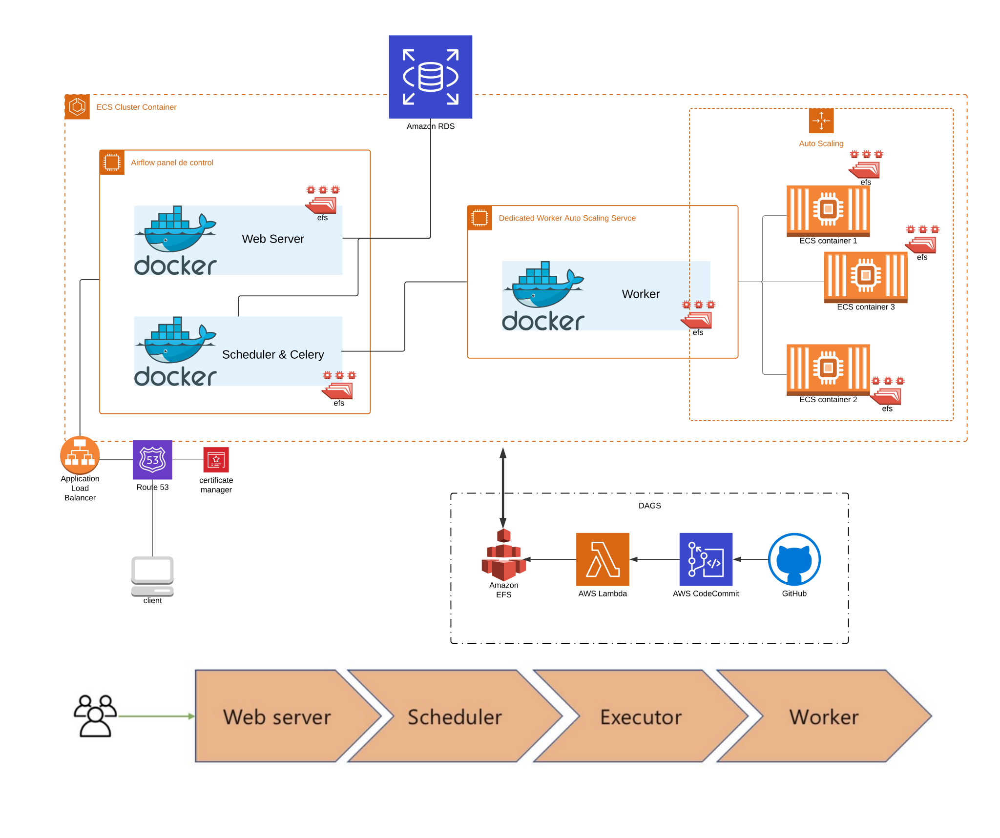

# CDK Apache Airflow

AWS CDK infrastructure for running Apache Airflow on ECS with EFS shared storage, RDS PostgreSQL, custom S3 XCom backend, and automated DAG deployment via GitHub Actions.

## Tech Stack

- **Infrastructure**: AWS CDK (Python)
- **Compute**: AWS ECS on EC2 with auto-scaling capacity providers
- **Storage**: Amazon EFS (shared DAGs/plugins), Amazon S3 (logs + XCom)
- **Database**: Amazon RDS PostgreSQL
- **Networking**: Application Load Balancer, Route53, ACM (SSL)
- **Orchestration**: Apache Airflow 2.3 with CeleryExecutor + SQS broker
- **CI/CD**: GitHub Actions + DataSync

## How It Works

1. Developer pushes DAGs to GitHub; GitHub Actions syncs them to EFS via DataSync
2. Airflow Scheduler polls EFS for DAGs and queues tasks on SQS
3. Celery Workers execute tasks; large XCom results are stored in S3 (Parquet/JSON)
4. Logs stream to S3; Airflow UI is accessible via ALB with SSL and Route53 DNS
5. Workers auto-scale on CPU/memory utilization via ECS capacity providers

## Features

- Separate ECS task definitions for webserver/scheduler and worker
- EFS shared filesystem keeps DAGs in sync across all containers
- Custom S3 XCom backend for DataFrames and large payloads
- Worker auto-scaling (1-2 tasks) on CPU/memory thresholds
- S3 log storage with lifecycle rules (IA after 30 days)
- HTTPS with ACM certificate and Route53 public/private DNS
- GitHub Actions CI/CD for zero-downtime DAG deployment

## DAG submit procedure

## References

- [PRD](./prd.md)
- Blog post: [Scalable ETL Pipelines](https://yokharian.dev/posts/apache-airflow-architecture-design)
